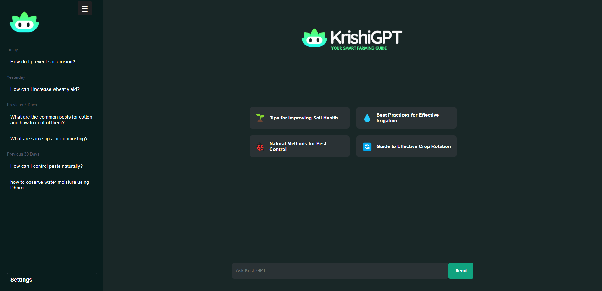
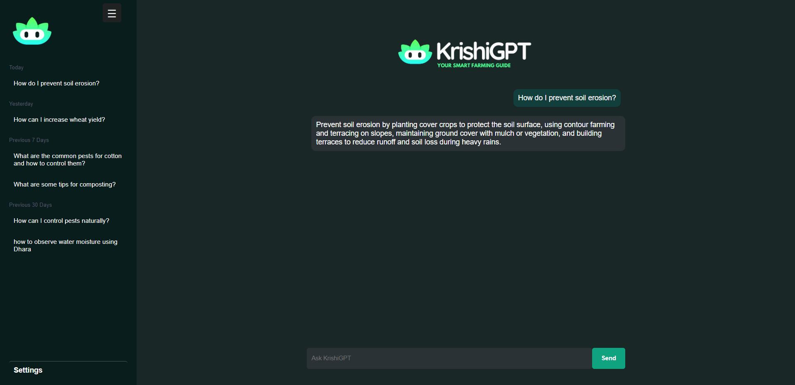

# 🌾 Krishi-GPT: Precision Farming Chatbot

## 📜 Project Overview

Krishi-GPT is a cutting-edge precision farming chatbot designed to empower farmers with real-time, field-specific insights. Using IoT sensors, our device Dhara gathers critical data from the field, which is then analyzed by Krishi-GPT to provide personalized, actionable recommendations. This helps farmers optimize crop yields, improve sustainability, and manage resources more efficiently.

## 🚀 Features

- **Real-Time, Field-Specific Insights:** Provides actionable recommendations based on live data from IoT sensors.
- **Personalized Recommendations:** Tailors advice to specific field conditions and crops.
- **Multilingual Support:** Offers multiple language options for diverse range of farmers.
- **Proactive Alerts:** Timely notifications on critical field conditions for quick response.

## 🛠️ Tech Stack

- **Backend:** Flask for handling API requests.
- **Deep Learning:** For generating personalized recommendations based on field data.
- **Deployment:** PM2 for process management and Apache for reverse proxy.
- **IoT Integration:** Dhara device for collecting real-time field data.

## 📸 Snapshots

  
  

## 🎥 Demo Video

[Watch the Demo Video](https://www.lastpass.com/features/password-generator)